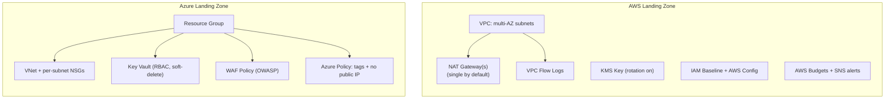

# Multi-Cloud Terraform Landing Zone

Spin up a secure, cost-guarded AWS and/or Azure foundation in an afternoon instead of discovering the gaps six months in.

## Problem & Solution

Most startups and SMBs stand up their first AWS or Azure account under deadline
pressure: a VPC/VNet gets created by hand, IAM users get broad permissions "just to
get it working," nothing is encrypted by policy, nobody sets a spending alert, and no
one is watching for configuration drift. That combination is how teams end up with
public S3 buckets, forgotten NAT gateways burning money for months, and no audit
trail when something breaks.

This repo is a reusable **landing zone**: a Terraform toolkit that gives a new (or
messy existing) AWS or Azure environment a secure-by-default baseline on day one --
network segmentation, encryption at rest, least-privilege IAM/RBAC, governance
policies, and a cost guardrail -- as versioned, tested infrastructure code instead of
a wiki page of manual console steps.

## Features

- **Multi-AZ network baseline** -- AWS VPC with public/private subnets and flow logs;
  Azure VNet with per-subnet Network Security Groups that deny inbound Internet by
  default.
- **Encryption at rest** -- AWS KMS key with automatic rotation; Azure Key Vault with
  soft-delete and purge protection enabled.
- **Least-privilege identity baseline** -- AWS account password policy, an MFA-gated
  break-glass admin role, and a read-only auditor role; Azure RBAC role assignments.
- **Governance-as-code** -- AWS Config recorder + rules (required tags,
  no-public-read S3); Azure Policy assignments (require tags, deny public IPs).
- **Cost guardrail** -- an AWS Budget with multi-threshold SNS/email alerts, the same
  instinct behind catching unused NAT gateways, load balancers and AMIs before they
  show up on an invoice.
- **Edge protection building block** -- an Azure WAF policy (OWASP managed rules)
  ready to attach to a client's Application Gateway.
- **Fully tested without cloud credentials** -- native `terraform test` suites run
  against mocked AWS/Azure providers, so `terraform test` and CI never need a real
  account.

## Tech stack


## Screenshots

Screenshots pending -- see [`docs/screenshots/README.md`](docs/screenshots/README.md)
for what's planned (terminal output from `terraform validate`/`terraform test`/
`terraform plan` against a sandbox account).

## Architecture overview

Full write-up: [`docs/architecture.md`](docs/architecture.md).



## Local setup

**Prerequisites**

- [Terraform](https://developer.hashicorp.com/terraform/downloads) >= 1.9 (developed
  and tested against 1.9.8)
- For a real `plan`/`apply` (not required for validation or tests): an authenticated
  AWS CLI profile and/or `az login` session

**AWS example**

```bash
cd examples/aws-landing-zone
terraform init
terraform validate
cp terraform.tfvars.example terraform.tfvars   # then edit with your own values
terraform plan -var-file=terraform.tfvars
```

**Azure example**

```bash
cd examples/azure-landing-zone
terraform init
terraform validate
cp terraform.tfvars.example terraform.tfvars   # then edit with your own values
terraform plan -var-file=terraform.tfvars
```

## Environment variables / tfvars

**AWS** (`examples/aws-landing-zone/terraform.tfvars`)

| Variable | Description | Example |
|---|---|---|
| `aws_region` | AWS region to deploy into | `us-east-1` |
| `name_prefix` | Short name used in every resource name/tag | `acme` |
| `environment` | `dev`, `staging`, or `prod` | `dev` |
| `vpc_cidr` | VPC CIDR block | `10.0.0.0/16` |
| `availability_zones` | AZs to spread subnets across (>= 2) | `["us-east-1a","us-east-1b"]` |
| `public_subnet_cidrs` / `private_subnet_cidrs` | One CIDR per AZ | `["10.0.0.0/24","10.0.1.0/24"]` |
| `single_nat_gateway` | Cost guardrail: one shared NAT vs. one per AZ | `true` |
| `break_glass_principal_arns` | IAM ARNs allowed to assume the emergency admin role | `["arn:aws:iam::<id>:user/admin"]` |
| `key_administrators` | IAM ARNs allowed to administer the KMS key | `["arn:aws:iam::<id>:user/admin"]` |
| `monthly_budget_limit_usd` | Cost guardrail budget (USD) | `500` |
| `budget_notification_emails` | Emails subscribed to budget alerts | `["alerts@example.com"]` |

**Azure** (`examples/azure-landing-zone/terraform.tfvars`)

| Variable | Description | Example |
|---|---|---|
| `name_prefix` | Short name used in every resource name/tag | `acme` |
| `environment` | `dev`, `staging`, or `prod` | `dev` |
| `location` | Azure region | `eastus` |
| `address_space` | VNet address space | `["10.1.0.0/16"]` |
| `subnets` | Map of subnet name => address prefixes | see `terraform.tfvars.example` |
| `rbac_admin_object_ids` | Azure AD object IDs granted Key Vault Administrator | `["<object-id>"]` |
| `role_assignments` | Baseline RBAC role assignments | see `terraform.tfvars.example` |
| `required_tag_keys` | Tag keys enforced by the require-tags policy | `["environment","owner","project"]` |
| `policy_effect` | `Deny` or `Audit` for the governance policies | `Audit` |

Convenience wrapper scripts (not the Terraform runs themselves) can source
[`.env.example`](.env.example) -- copy it to `.env` and fill in placeholders; real
credentials still belong in your cloud CLI/SSO config, never in that file.

## Running tests

Every module and example ships native Terraform tests (`*.tftest.hcl`) that run
against `mock_provider "aws" {}` / `mock_provider "azurerm" {}` -- no cloud
credentials, accounts, or network access needed:

```bash
# AWS modules
(cd modules/aws/vpc && terraform init -backend=false && terraform test)
(cd modules/aws/kms && terraform init -backend=false && terraform test)

# Azure modules
(cd modules/azure/vnet && terraform init -backend=false && terraform test)
(cd modules/azure/keyvault && terraform init -backend=false && terraform test)

# Full landing zone wiring
(cd examples/aws-landing-zone && terraform init -backend=false && terraform test)
(cd examples/azure-landing-zone && terraform init -backend=false && terraform test)
```

See [`tests/README.md`](tests/README.md) for the full list and why tests live next to
the configuration they exercise rather than in one shared directory.

## Deployment notes

Running a real `terraform apply` requires your own AWS and/or Azure credentials and
**will incur cloud costs** (NAT gateways, Key Vault, etc. are billed resources). This
repo's CI pipeline never runs `apply` and never touches a real cloud account --
`terraform fmt`, `terraform validate`, and `terraform test` (mocked providers) are all
that run automatically. Applying to a real environment is a deliberate, manual step
you take with your own credentials.

## What I'd build next

- **Multi-account AWS Organizations** with a dedicated log-archive/security account
  and SCPs, instead of a single-account baseline.
- **Azure Management Groups** with policy inheritance across subscriptions, rather
  than per-resource-group policy assignment.
- **A policy-as-code gate in CI** (Sentinel, OPA/Conftest, or `checkov`/`tfsec` as a
  required check) so non-compliant plans are blocked before merge, not just flagged.
- **Cross-account/cross-subscription state backends** (S3+DynamoDB, Azure Storage)
  with remote state locking, once a client has more than one environment.
- **An Azure cost-guardrail module** (Cost Management budgets + action groups) to
  mirror the AWS Budgets module.

## Contact

Built by **Rakesh Chaudhari** -- DevOps/Cloud engineer (CKA, CKS, Azure Solutions
Architect Expert).

- LinkedIn: [linkedin.com/in/crak](https://www.linkedin.com/in/crak)
- Email: [C.rakesh31196@gmail.com](mailto:C.rakesh31196@gmail.com)
