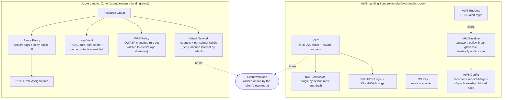

# Architecture

Both landing zones follow the same shape -- a network perimeter, an encryption/secrets
layer, and a governance/cost layer -- built with the equivalent native service on each
cloud. Pick the cloud (or both) a client is actually using; the modules are independent.

## Layer-by-layer mapping

| Concern | AWS module | Azure module |
|---|---|---|
| Network perimeter | `modules/aws/vpc` | `modules/azure/vnet` |
| Encryption at rest | `modules/aws/kms` | `modules/azure/keyvault` (also holds secrets) |
| Edge protection | (client-specific ALB/WAF, not in scope) | `modules/azure/waf` |
| Identity/governance | `modules/aws/iam-baseline` (password policy, break-glass role, AWS Config) | `modules/azure/rbac-baseline` (role assignments, Azure Policy) |
| Cost guardrail | `modules/aws/budget-guardrail` | *(planned -- see "What I'd build next")* |

## Design notes

- **Secure by default, not locked down forever.** Governance policies default to
  `Deny` on AWS Config side; the Azure policy module exposes a `policy_effect`
  variable (`Deny`/`Audit`) so a client can onboard existing, imperfect resources in
  `Audit` mode before flipping to enforcement.
- **Cost guardrails are alerts, not blockers.** The AWS Budget and (planned) Azure
  cost-alert modules never delete resources automatically -- they alert a human,
  mirroring how unused NAT gateways/load balancers/AMIs actually get caught and
  removed in practice.
- **Naming/tagging convention.** Every module names resources
  `<name_prefix>-<environment>-<purpose>` and merges a common
  `{ Project, Environment, ManagedBy }` tag set with caller-supplied tags.
- **WAF attachment is deliberately left to the client's own Application Gateway
  configuration** -- see `modules/azure/waf/main.tf` for the documented attachment
  pattern.
